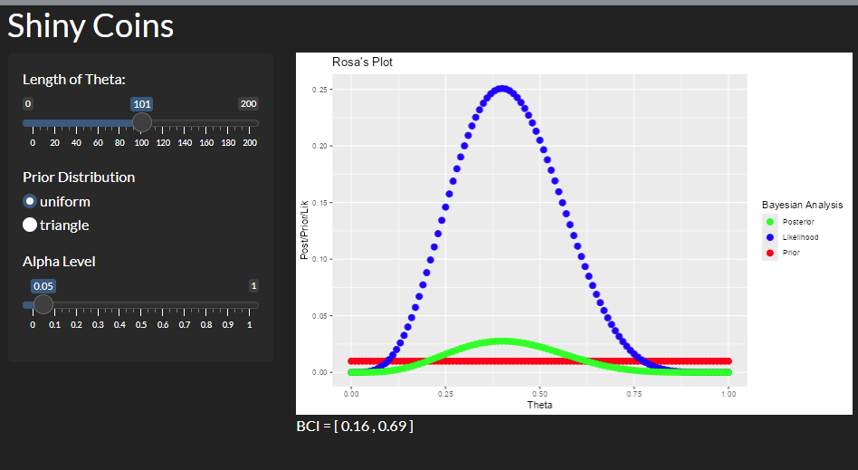

```{r, include = FALSE}
knitr::opts_chunk$set(
  collapse = TRUE,
  comment = "#>",
  fig.align = 'center',
  fig.width = 7,
  fig.height = 5
)
```

```{r setup}
library(RosaDSA5403lab2)
```

# Introduction

This package contains a function `coin()` which produces a plot of the prior, posterior, and likelihood distributions. Also it returns a named list. This package also contains an interactive shiny app, `shinycoins`.

# Example of the `coin()` function

```{r}
coin(theta = seq(0,1,length = 101), prior = "uniform", n = 10, z = 4, alpha = 0.05)
```

# The Shiny App: `shinycoins()`

This package contains a function, `shinycoins()`, which will open the shiny app `Shiny Coins` in a new browser window.

A screenshot of the app in action is below.



The shiny app can be accessed in an active `R` session by running the following code:

```{r, eval=FALSE}
shiny::runGitHub(repo = "RosaDSA5403lab2", username = "brandanrosa", subdir = "inst/shinycoins")
```


